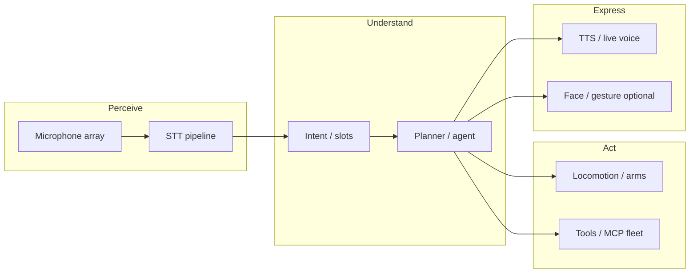
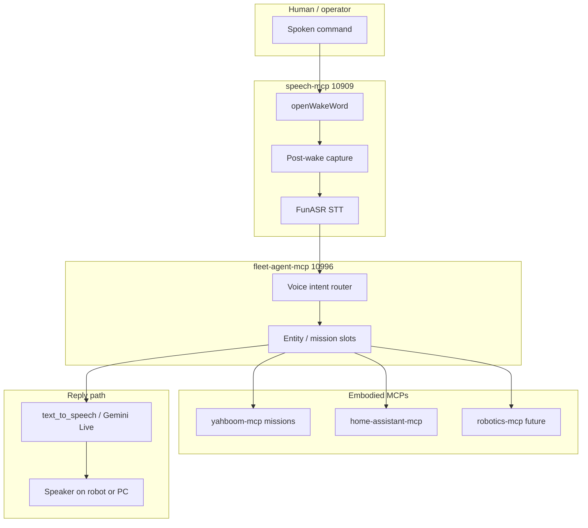

# Humanoid voice — why speech-mcp exists

This document states the **product and systems thesis** behind speech-mcp: why high-quality speech tooling is not a side feature but **infrastructure for embodied agents and humanoid robots**, and why **Chinese open-weight speech stacks** (with **FunASR** as the integrated default) are the right anchor for this fleet.

**Audience:** maintainers, integrators, robot bridge authors, and agents indexing the repo.

**Related:**

- [providers/funasr.md](providers/funasr.md) — operate FunASR in speech-mcp today
- [VOICE_COMMAND_BUS.md](VOICE_COMMAND_BUS.md) — wake → STT → fleet-agent intent
- [CHINESE_AI_RESEARCH.md](CHINESE_AI_RESEARCH.md) — Chinese FOSS speech landscape
- [YAHBOOM_RASPBOT_VOICE.md](YAHBOOM_RASPBOT_VOICE.md) — Raspbot / Yahboom bridge pattern
- [local_voice_alternatives.md](local_voice_alternatives.md) — kyutai-mcp (offline duplex)
- Fleet standard: `mcp-central-docs/standards/VOICE_COMMAND_BUS.md`

---

## 1. Thesis (short)

**Good speech tools are crucial for humanoid robots.**

A humanoid is judged on whether it can **hear**, **understand spoken intent**, **act**, and **respond naturally** — often hands-free, in noise, at conversational distance. That is a speech problem before it is a “bigger LLM” problem.

**China is pushing open, deployable speech AI as industrial infrastructure** — models on ModelScope/HuggingFace, toolkits (FunASR, CosyVoice, SenseVoice), edge ONNX, and server CLIs — aligned with robotics, smart devices, and agent fleets. Whether driven by policy, supply chain, or market scale, the **technical output** is what matters for builders: **weights you can run, RTF you can budget, pipelines you can ship**.

**speech-mcp** is the fleet **voice gateway**: local STT (FunASR), optional cloud TTS/live polish, wake word, RAG, and the **Voice Command Bus** into fleet-agent for embodied missions (e.g. Yahboom patrol). It is MCP-native so Claude Desktop, Cursor, and headless services share one speech layer.

---

## 2. Why speech is load-bearing for humanoids

Humanoids are not chat apps on wheels. The control loop looks like this:



### 2.1 Speech is the default HRI channel

- **Hands-free:** operator or bystander speaks; robot should not require a phone UI for every command.
- **Low latency:** command-and-control (stop, come here, patrol) needs sub-second perception-to-intent, not a 30s cloud round-trip if avoidable.
- **Structured output:** planners need **segments, timestamps, speakers** — not a single blob of text. FunASR’s unified VAD + ASR + punctuation + diarization targets exactly that.
- **Barge-in:** duplex conversation (Gemini Live, or kyutai-mcp/Moshi offline) requires interruptible playback — see [gemini_live.md](gemini_live.md) and kyutai-mcp.

### 2.2 Failure modes when speech is weak

| Symptom | Root cause | Humanoid impact |
|--------|------------|-----------------|
| “It didn’t hear me” | Bad VAD / far-field ASR | Unsafe or ignored stop commands |
| “It heard wrong” | Noisy ASR without domain tuning | Wrong mission (wrong room, wrong target) |
| “It answered but sounded dead” | Robotic TTS or cloud-only | Poor trust in social HRI |
| “It only works online” | Cloud STT subscription / latency | Field robots, privacy, cost |
| “Agent can’t act” | STT not wired to fleet planner | Speech is a demo, not a command surface |

speech-mcp is designed to reduce the first four via **FunASR + local wake**, and the fifth via **Voice Command Bus → fleet-agent**.

### 2.3 Speech vs “just add a bigger LLM”

A larger language model does not replace:

- **Acoustic front-end** (echo, reverb, motor noise on humanoids)
- **Streaming STT** with stable partials for interrupt logic
- **Diarization** (“operator vs crowd”)
- **TTS with prosody** for status and empathy

The LLM consumes **text** and produces **text**. Speech-mcp owns the **audio ↔ text** boundary and exposes it to MCP agents.

---

## 3. China’s industrial speech trajectory (technical framing)

This section describes **observable engineering trends**, not geopolitical commentary. The useful claim for builders:

> Chinese open-weight speech ecosystems optimize for **deployment at scale** — factories, devices, robots, call centers — not only leaderboard WER on clean read speech.

### 3.1 What “push” means in practice

| Signal | What builders get |
|--------|-------------------|
| **Open weights** on ModelScope / HuggingFace | Reproducible installs, fine-tuning, air-gapped deploy |
| **Unified toolkits** (FunASR) | One `AutoModel()` for VAD+ASR+punc+speakers |
| **Published RTF tables** | Capacity planning for edge GPUs and NUCs |
| **ONNX / INT8 / Windows SDK** | Non-PyTorch runtimes on edge and industrial PCs |
| **funasr-server** | OpenAI-compatible HTTP — sidecar pattern for fleets |
| **FunAudioLLM line** | SenseVoice (STT/events), CosyVoice (TTS) — same research lineage |
| **Agent docs upstream** | FunASR MCP server (v1.3.3+) — ecosystem expects agents |

### 3.2 Why this aligns with humanoids

Humanoids need **edge-first** perception:

- Cannot assume stable cloud on every factory floor or home.
- Cannot assume \$0.006/min STT forever on a robot that listens continuously.
- Benefit from models trained on **noisy, real-world** Mandarin/English/multilingual audio — Fun-ASR and SenseVoice marketing and papers emphasize messy audio, not studio read speech.

### 3.3 FunASR as the speech-mcp default (not accidental)

[FunASR](providers/funasr.md) is the integrated default STT because it is the **most complete industrial package** today for agent fleets:

1. **One pipeline** — fewer moving parts on a robot brain NUC.
2. **MCP tools** — `transcribe_audio_file`, `transcribe_stream_chunk`.
3. **Sidecar** — GPU box runs `funasr-server`; speech-mcp stays light on the agent host.
4. **Structured transcripts** — downstream fleet-agent can parse missions.
5. **Roadmap** — CosyVoice/ChatTTS/GPT-SoVITS documented as TTS/cloning candidates in [CHINESE_AI_RESEARCH.md](CHINESE_AI_RESEARCH.md).

Other Chinese ASR projects (FireRedASR, WeNet) remain valuable; this repo standardizes on FunASR for **fleet operability**, not a single WER point.

---

## 4. Reference architecture — speech-mcp in the fleet

### 4.1 Logical layers



### 4.2 Desktop installer (Tauri)

Windows **Speech MCP** installer (Tauri 2 + PyInstaller sidecar) bundles the cockpit and backend on **10909**. FunASR is not bundled in the installer — use a dev install with `uv sync --extra funasr` for edge STT. Build: `just build-native`.

### 4.3 Ports (fleet-safe)

| Service | Port | Role |
|---------|------|------|
| speech-mcp webapp | 10908 | Dashboard, Voice Chat UI |
| speech-mcp backend | 10909 | MCP SSE, REST, WebSocket, wake listener |
| FunASR sidecar (optional) | 10910 | OpenAI-compatible STT HTTP |
| fleet-agent-mcp | 10996 | SpeechIntent routing |
| kyutai-mcp (optional) | 10924–10926 | Offline duplex Moshi — parallel, not replacement |

See `mcp-central-docs/operations/WEBAPP_PORTS.md` for the full reservoir.

### 4.4 Voice Command Bus (embodied commands)

Canonical flow — [VOICE_COMMAND_BUS.md](VOICE_COMMAND_BUS.md):

1. **Wake** — `FLEET_VOICE_WAKE_KEYWORD` (default `hey_jarvis`; production target custom ONNX e.g. `wakeywakey`).
2. **Record** — `FLEET_VOICE_COMMAND_SECONDS` (default 6s) on the same mic stream.
3. **STT** — FunASR via hook registered at server startup when `FUNASR_ENABLED=true`.
4. **Route** — `POST` JSON to `FLEET_VOICE_ROUTER_URL` (default `http://127.0.0.1:10996/api/voice/intent`).
5. **Act** — fleet-agent dispatches to yahboom-mcp, homeassistant-mcp, etc.

Example utterance:

> *"hey jarvis … boomy go on patrol and report what you found"*

→ `yahboom_agent_mission` (see fleet-agent and yahboom-mcp docs).

### 4.5 Yahboom / education robots (today)

Not a full humanoid, but the **same integration pattern** applies:

- Robot may have **onboard CI1302** STT/TTS (fixed commands).
- speech-mcp adds **open-vocabulary** commands via FunASR + fleet routing.
- Bridge: robot STT text → agent, or PC mic → Voice Command Bus → mission.

Details: [YAHBOOM_RASPBOT_VOICE.md](YAHBOOM_RASPBOT_VOICE.md).

### 4.6 Humanoid-scale (tomorrow)

| Component | Today in fleet | Humanoid note |
|-----------|----------------|---------------|
| Far-field mic array | OS default via PyAudio | Mount + beamforming still robot-side |
| Local STT | FunASR | Run on torso NUC or sidecar GPU |
| Intent | fleet-agent | Map to manipulation/nav skills |
| Duplex dialog | Gemini Live / kyutai-mcp | Face-to-face interaction |
| Expressive TTS | Gemini / Hume / ElevenLabs; CosyVoice future | Lip-sync is downstream |
| Safety stop | Must be hard real-time | **Do not** rely only on cloud STT for e-stop |

---

## 5. Deployment topologies

### 5.1 Edge-native (robot brain)

```
[Human] → [Robot mic] → [Onboard NUC: speech-mcp + FunASR torch] → [fleet-agent] → [actuators]
```

- **Pros:** Lowest cloud dependency, privacy.
- **Cons:** VRAM, heat, model updates on device.
- **Env:** `FUNASR_ENABLED=true`, `FUNASR_DEVICE=cuda:0` or `cpu`.

### 5.2 Sidecar GPU (recommended for dev fleets)

```
[Human] → [PC or robot mic] → [speech-mcp] → HTTP → [10910 funasr-server] → [fleet-agent]
```

- **Pros:** speech-mcp process stays small; share one GPU STT box across services.
- **Cons:** Network hop; secure localhost binding.
- **Env:** `FUNASR_OPENAI_URL=http://127.0.0.1:10910/v1`

Start: `uv run python scripts/start_funasr_sidecar.py`

### 5.3 Cloud-augmented (social layer)

```
[FunASR local command path] + [Gemini Live / TTS for conversation quality]
```

- **Pros:** Best prosody and dialogue; RAG via `ask_docs`.
- **Cons:** API keys, latency, cost — use for **interaction**, not safety-critical stops.

### 5.4 Headless NSSM (production operator)

Register speech-mcp backend **10909** with:

- `FLEET_VOICE_DELEGATE=1`
- `FUNASR_ENABLED=true`
- fleet-agent on **10996**

See central `VOICE_COMMAND_BUS` standard §5 for Windows service pattern.

---

## 6. Operator checklist — humanoid-ready voice stack

### 6.1 Install

```powershell
git clone https://github.com/sandraschi/speech-mcp
cd speech-mcp
uv sync --extra funasr
Copy-Item .env.example .env
```

### 6.2 Minimum `.env` for embodied commands

```env
FUNASR_ENABLED=true
FUNASR_MODEL=FunAudioLLM/Fun-ASR-Nano-2512
FUNASR_DEVICE=cuda:0

FLEET_VOICE_DELEGATE=1
FLEET_VOICE_ROUTER_URL=http://127.0.0.1:10996/api/voice/intent
FLEET_VOICE_WAKE_KEYWORD=hey_jarvis
FLEET_VOICE_COMMAND_SECONDS=6
```

### 6.3 Start services

1. fleet-agent-mcp (10996)
2. speech-mcp backend (10909) or `just start`
3. MCP: `configure_local_wake_word(action="start")`

### 6.4 Verify STT without wake

```
transcribe_audio_file(file_path="path/to/test.wav", provider="funasr")
```

Or REST:

```http
POST /api/v1/transcribe?provider=funasr&language=auto
Content-Type: application/octet-stream

<raw audio bytes>
```

### 6.5 Verify full bus

Speak wake + command; confirm fleet-agent logs show SpeechIntent and target MCP mission fires.

---

## 7. Latency and hardware budgeting

| Stage | Order of magnitude | Notes |
|-------|-------------------|--------|
| Wake detection | Continuous, low CPU | openWakeWord |
| Post-wake record | 6s default | Trade-off: longer = more context, worse UX |
| FunASR RTF | Up to ~170× GPU, ~17× CPU (published) | Measure on **your** mic + noise |
| fleet-agent route | HTTP + planner | Keep router local |
| TTS reply | 0.5–3s cloud; local TTS varies | Parallelize with motion if safe |

**Humanoid lesson:** budget **end-to-end** “stop” separately from “chat.” Stop should prefer **hardware e-stop + simple wake**, not a full cloud dialog turn.

---

## 8. Chinese FOSS roadmap vs speech-mcp

| Capability | Best Chinese FOSS anchor | speech-mcp status |
|------------|-------------------------|-------------------|
| Industrial STT | FunASR / SenseVoice | **Done** |
| Emotion/events in STT | SenseVoice via hub | **Via FunASR model choice** |
| Zero-shot TTS | CosyVoice 2/3 | Future provider |
| Conversational TTS | ChatTTS | Future provider |
| Voice clone | GPT-SoVITS | Future provider |
| Duplex voice AI | Moshi (kyutai-mcp) | Sibling repo |
| Cloud polish | Gemini, Hume, ElevenLabs | Done |

Prioritize **FunASR + fleet bus** for any new humanoid integration PR; add CosyVoice when local **spoken replies** must match Chinese prosody without cloud.

---

## 9. MCP tools agents should know

| Tool | Humanoid use |
|------|----------------|
| `transcribe_audio_file` | Log analysis, batch commands from recorded WAV |
| `transcribe_stream_chunk` | Bridge from robot telemetry mic frames |
| `configure_local_wake_word` | Enable/disable fleet delegate listener |
| `text_to_speech` | Status messages to onboard speaker |
| `agentic_conversation_workflow` | Plan multi-step voice missions |
| `search_docs` / `ask_docs` | Operator manuals, RAG over robot docs |

Tool parameters: [tools-reference.md](tools-reference.md).

---

## 10. Safety and expectations (beta)

speech-mcp is **beta (pre-1.0)**. For humanoids:

- Do **not** use cloud STT/TTS as the only emergency stop path.
- Treat wake word + FunASR as **best-effort open vocabulary**, not certified safety SIL.
- Review [SECURITY.md](../SECURITY.md) and mic privacy policies for deployed environments.
- Model licenses: FunASR code MIT; **weights** under FunASR Model License — review for commercial redistribution.

---

## 11. Summary

| Claim | Implication for this repo |
|-------|---------------------------|
| Speech is core HRI for humanoids | speech-mcp is a **gateway**, not a demo |
| China ships deployable open speech stacks | **FunASR default**, research doc for siblings |
| Fleets need MCP + local STT + routing | **Voice Command Bus** + fleet-agent |
| Cloud is for quality, not sole perception | Gemini/Hume/ElevenLabs optional layer |
| Education robots prove the bus | Yahboom today; humanoid same pattern |

**Next reads:**

1. [providers/funasr.md](providers/funasr.md) — enable STT
2. [VOICE_COMMAND_BUS.md](VOICE_COMMAND_BUS.md) — enable missions
3. [CHINESE_AI_RESEARCH.md](CHINESE_AI_RESEARCH.md) — ecosystem map
4. [README.md](../README.md) — quick start

---

*Maintainer stance: invest in open, local, structured speech perception first; wire it to fleet planners second; add expressive cloud voice third. That ordering matches both humanoid constraints and the current Chinese open-weight speech wave.*
