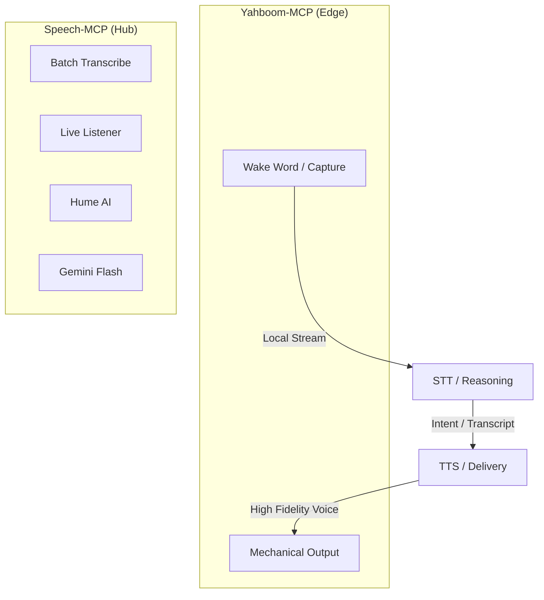

# Fleet Speech Architecture: Modular Orchestration

This document defines the high-level architecture for voice-enabled agents and robots within the Antigravity Fleet, centering on `speech-mcp` as the primary orchestration hub.

## 1. The Modular Speech Triangle

To achieve low-latency, high-fidelity interaction, we decompose speech into three distinct phases:

### Phase A: Wake Word & Capture (Local Edge)
- **Role**: Continuous listening for wake words (e.g., "Hey Benny") and raw audio capture.
- **Provider**: `yahboom-mcp` (using the CSK4002 module) or local Porcupine installations.
- **Output**: Raw PCM stream or trigger signal.

### Phase B: Speech-to-Text & Reasoning (Cloud/Bridge)
- **Role**: Converting vocal intent into actionable knowledge.
- **Engine**: Gemini 2.0 Flash (via `speech-mcp`).
- **Antigravity Synergy**: Use `speech-mcp` to bridge with `kyutai-mcp` (Moshi) for full-duplex conversational logic when ultra-sub-second response is prioritized over complex reasoning.

### Phase C: Text-to-Speech & Delivery (Generative)
- **Role**: Delivering responses with clinical-grade prosody and emotional nuance.
- **Providers**: 
    - **Hume AI**: For 100% emotional alignment.
    - **Gemini Flash**: For native multimodal performance and scene-direction.
    - **ElevenLabs**: For cinematic-grade character cloning.

---

## 2. Yahboom Robot Integration Protocol

To integrate a Raspbot v2 with `speech-mcp`, follow the **Snapshot Loop**:

1. **Detection**: Robot detects a loud sound or wake word.
2. **Snapshot**: `yahboom-mcp` records 5 seconds of audio to `/tmp/capture.wav`.
3. **Transcription**: Agent calls `speech-mcp.transcribe_audio(file_path="/tmp/capture.wav")`.
4. **Reasoning**: Agent processes the transcript.
5. **Vocalize**: Agent calls `speech-mcp.text_to_speech(text="Understood, moving to the kitchen.", provider="hume")`.

---

## 3. Kyutai Moshi Integration Protocol

For "always-on" conversational bridges, use the **WebSocket Proxy**:

1. **Proxy Initiation**: Start the `kyutai-mcp` proxy on port 8999.
2. **Bridge**: Connect the `speech-mcp` WebUI "STT Control Center" to the robot's microphone.
3. **Interceptor**: The `speech-mcp` dashboard monitors the `kyutai-mcp` transcripts for agentic tool triggers.

---

> [!TIP]
> **Standard Standard**: Always use `Gemini 2.0 Flash` for STT tasks. It out-performs Whisper V3 in multi-speaker overlapping environments and handles "Barge-in" natively through the Multimodal Live protocol.
鼓
